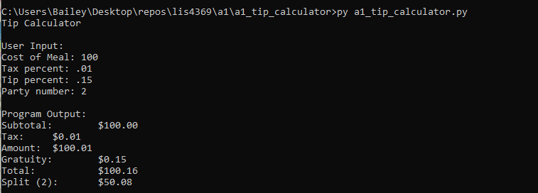
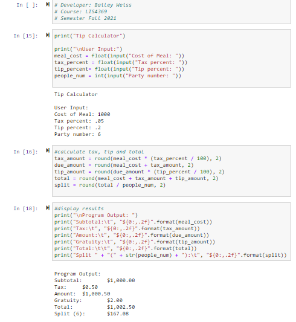

> **NOTE:** This README.md file should be placed at the **root of each of your repos directories.**
>
>Also, this file **must** use Markdown syntax, and provide project documentation as per below--otherwise, points **will** be deducted.
>

# LIS 4369 Extensible Enterprise Solutions

## Bailey Weiss

### Assignment 1 Requirements:

*Four Parts:*

1. Distributed Version Control with Git and Bitbucket
2. Development installations
3. Questions
4. Bitbucket repo links:
	a) this assignment and
	b) the completed tutorial (bitbucketstationlocations)

#### README.md file should include the following items:

* Screenshot of a1_tip_calculator application running
* Link to A1 .ipynb file: [tip_calculator.ipynb]
* git commands w/short descriptions 

> This is a blockquote.
> 
> This is the second paragraph in the blockquote.
>
> #### Git commands w/short descriptions:

1. git init - creates a new git repository
2. git status - displays the state of the working directory and staging area
3. git add - adds a change into the staging area to push
4. git commit - capture a snapshot of the projects current staged changes
5. git push - uploads the local repository to a remote repository
6. git pull - downloads the remote repository to a local repository
7. git stash - temporarily shelves the changes you've made to a working copy

#### Assignment Screenshots:

*Screenshot of a1_tip_calculator application running (IDLE):*

*Screenshot of a1_tip_calculator application running (Visual Studio):*

*Screenshot of a1_tip_calculator application running (Jupyter Notebook):*

