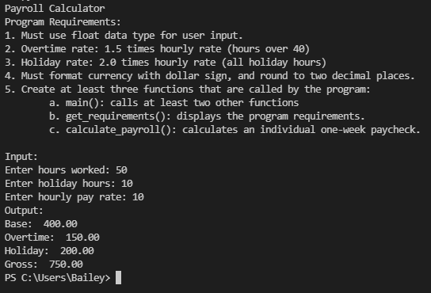

> **NOTE:** This README.md file should be placed at the **root of each of your repos directories.**
>
>Also, this file **must** use Markdown syntax, and provide project documentation as per below--otherwise, points **will** be deducted.
>

# LIS 4369 Extensible Enterprise Solutions

## Bailey Weiss

### Assignment 2 Requirements:

*Three Parts:*

1. Backward-engineer Payroll Application in IDLE and Visual Studio Code
2. Upload .ipynb file with link in README.md
3. Questions

#### README.md file should include the following items:

* Screenshot of a2_payroll application running
* Link to A2 .ipynb file: [payroll.ipynb] 

#### Assignment Screenshots:
*Screenshot of a2_payroll application code (VS):*

*Screenshot of a2_payroll application running (IDLE):*

*Screenshot of a2_payroll application running (Visual Studio):*

*Screenshot of a2_payroll application running (Jupyter Notebook):*

#### [.ipynb link here](a2_payroll/Untitled.ipynb)