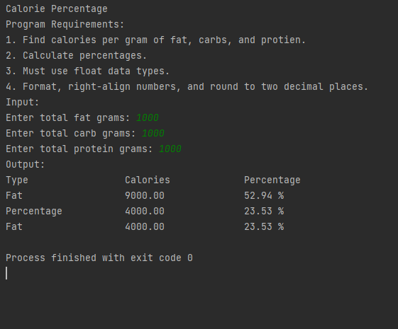

> **NOTE:** This README.md file should be placed at the **root of each of your repos directories.**
>
>Also, this file **must** use Markdown syntax, and provide project documentation as per below--otherwise, points **will** be deducted.
>

# LIS4369 Extensible Enterprise Solutions

## Bailey Weiss

### Assignment #3 Requirements:

*Four Parts:*

1. Backward-engineer skill sets 4, 5, & 6
2. Create the Painting Estimator 
3. Upload .ipynb file with link in README.md
4. Questions

#### Assignment Screenshots:

*Screenshot of Skill Set 4 running*:

*Screenshot of Skill Set 5 running*:

*Screenshot of Skill Set 6 running*:

*Screenshot of Painting Estimator running on Visual Studio*:

*Screenshot of Painting Estimator running Anaconda*:

*Screenshot of Painting Estimator running http://localhost*:

#### [.ipynb link here](python/main.ipynb)