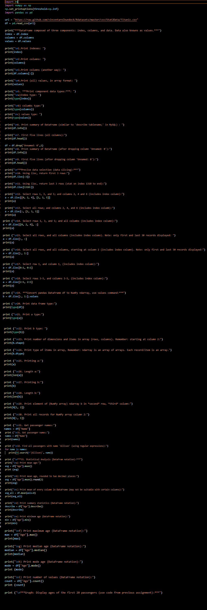
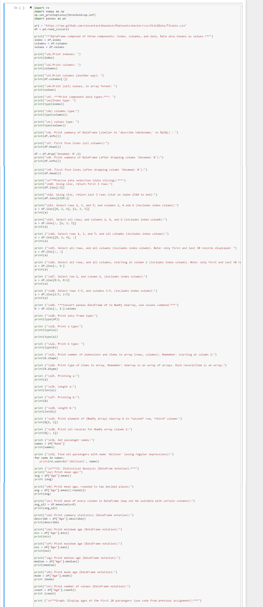
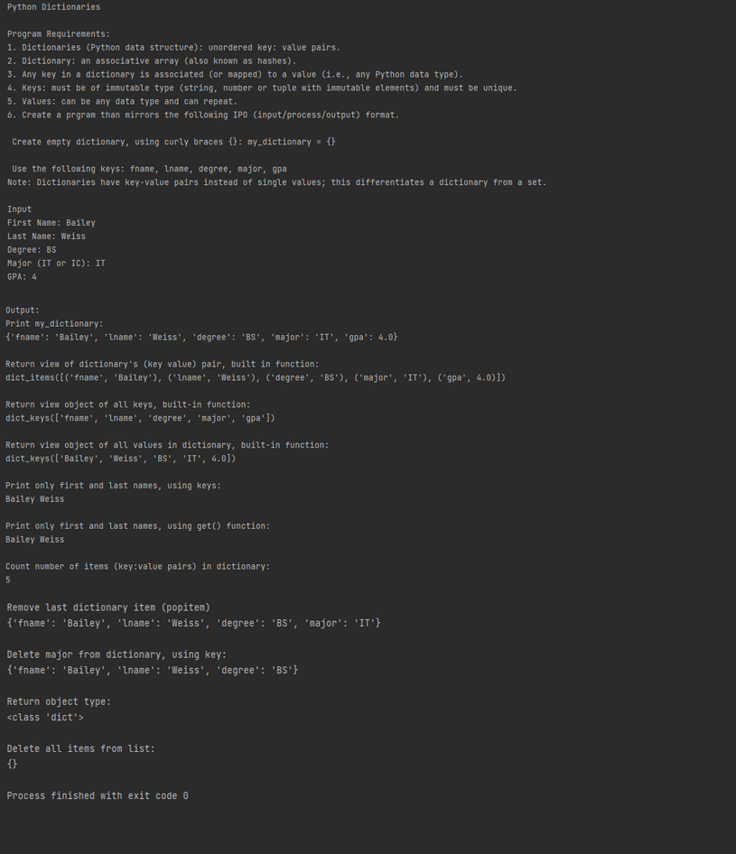
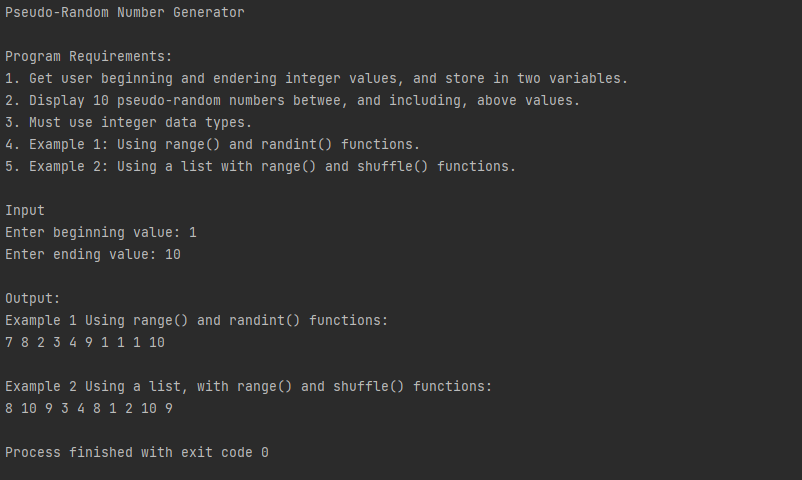
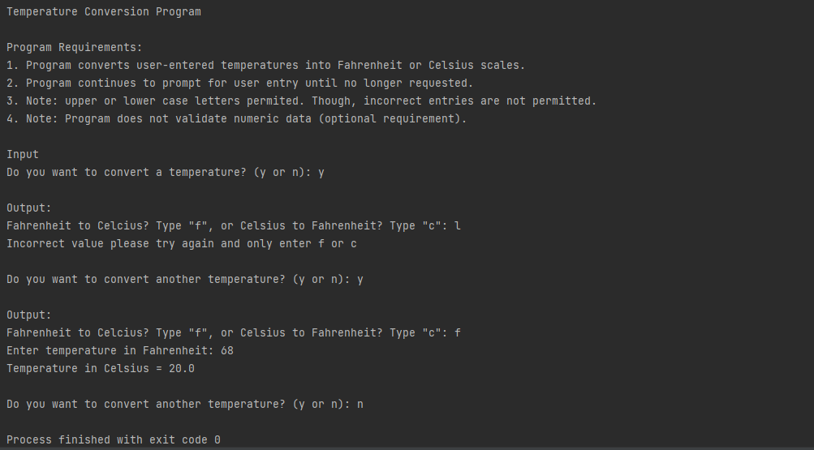

> **NOTE:** This README.md file should be placed at the **root of each of your repos directories.**
>
>Also, this file **must** use Markdown syntax, and provide project documentation as per below--otherwise, points **will** be deducted.
>

# LIS4369 Extensible Enterprise Solutions

## Bailey Weiss

### Assignment #4 Requirements:
1. A4 in Visual Studio
2. Skill set 10
3. Skill set 11
4. Skill set 12
5. ipny attachment

#### Assignment Screenshots:

*Screenshot of A4 in Visual Studio*:

*Screenshot of A4 in Jupyter Notebook*:

*Screenshot of Skill Set 10 running*:

*Screenshot of Skill Set 11 running*:

*Screenshot of Skill Set 12 running*:

#### [.ipynb link here](python/main.ipynb)