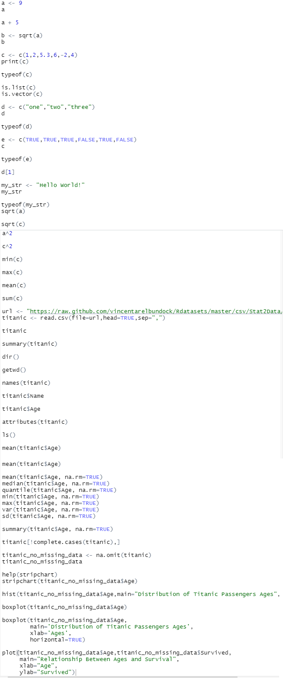
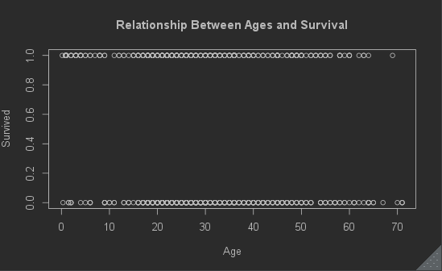
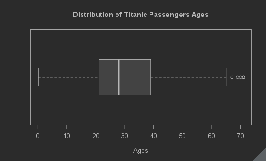
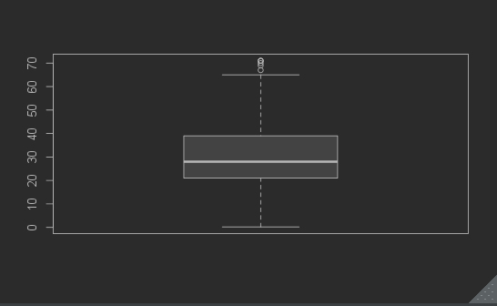
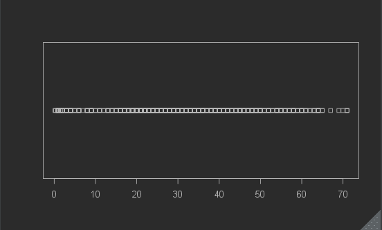
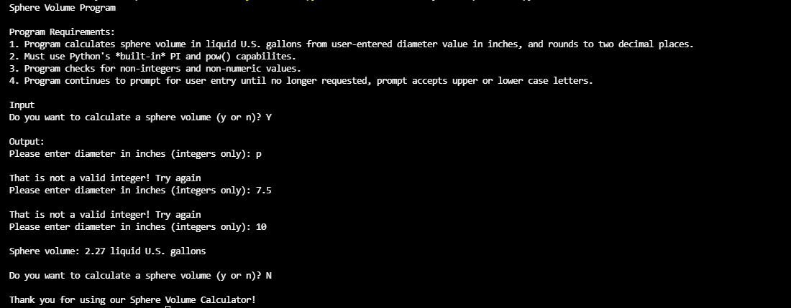
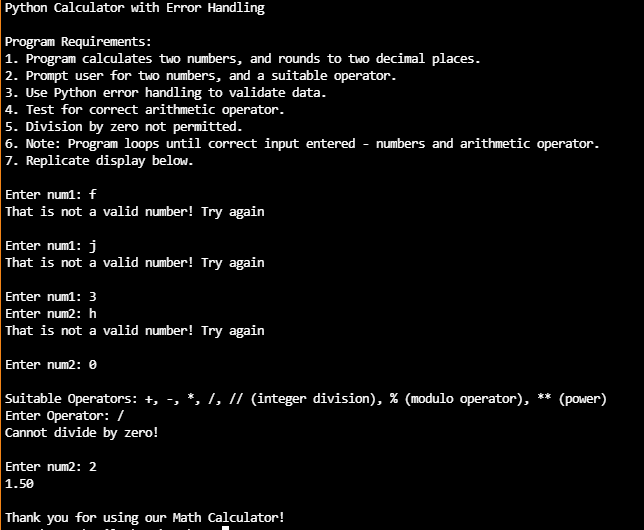
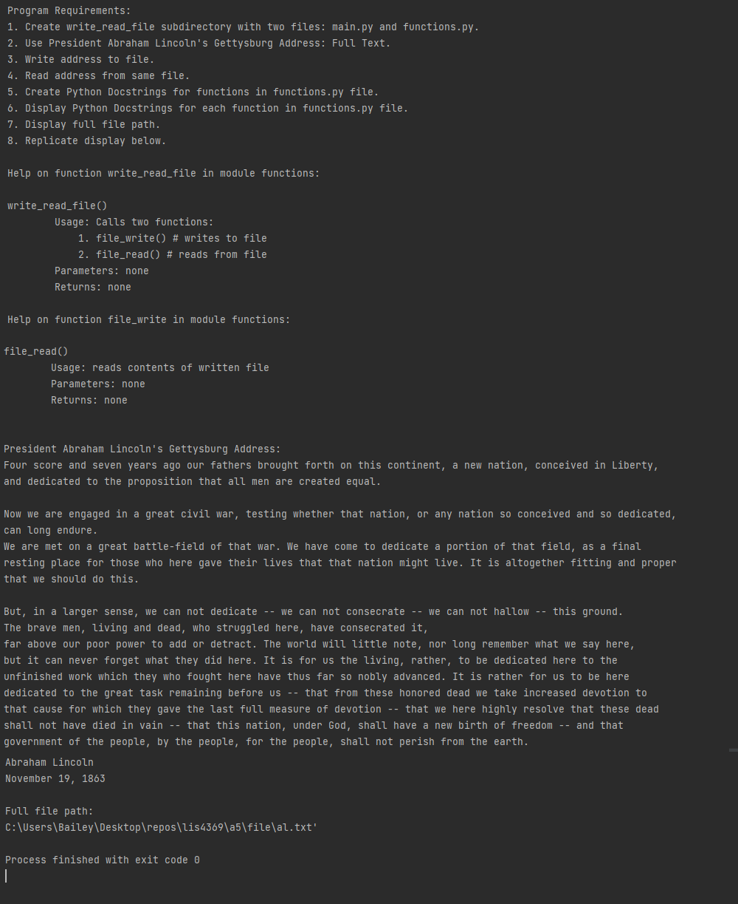

> **NOTE:** This README.md file should be placed at the **root of each of your repos directories.**
>
>Also, this file **must** use Markdown syntax, and provide project documentation as per below--otherwise, points **will** be deducted.
>

# LIS4369 Extensible Enterprise Solutions

## Bailey Weiss

### Assignment #5 Requirements:
1. A5 in Visual Studio
2. Skill set 13
3. Skill set 14
4. Skill set 15
5. R attachment

#### Assignment Screenshots:

*Screenshot of A5 in R Studio*:

*Screenshot of Skill Set 13 running*:

*Screenshot of Skill Set 14 running*:

*Screenshot of Skill Set 15 running*:

#### [.R link here](R/a5.R)