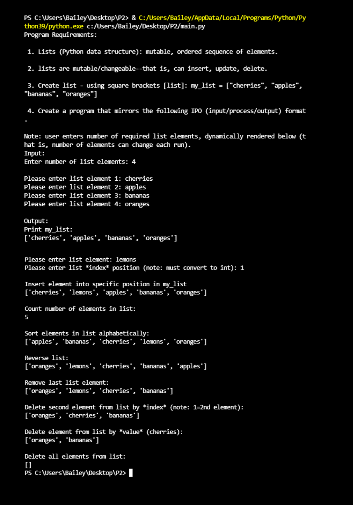

> **NOTE:** This README.md file should be placed at the **root of each of your repos directories.**
>
>Also, this file **must** use Markdown syntax, and provide project documentation as per below--otherwise, points **will** be deducted.
>

# LIS4369 Extensible Enterprise Solutions

## Bailey Weiss

### Project #1 Requirements:

*Four Parts:*

1. Backward-engineer skill sets 7, 8, & 9
2. Create the P1 Plot 
3. Upload .ipynb file with link in README.md
4. Questions

#### Assignment Screenshots:

*Screenshot of Skill Set 7 running*:

*Screenshot of Skill Set 8 running*:

*Screenshot of Skill Set 9 running*:

*Screenshot of P1 Plot running on Visual Studio*:

*Screenshot of P1 Plot Figure*:

*Screenshot of P1 Plot running http://localhost*:

*Screenshot of P1 Plot Figure running http://localhost*:

#### [.ipynb link here](python/main.ipynb)